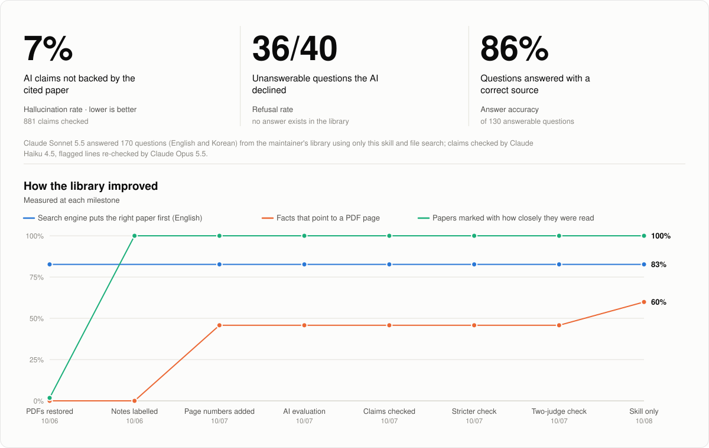

# Obsidian Research Wiki: Reference

한국어 | [English](README.md)

> 출처와의 연결을 유지하면서 논문을 추적 가능한 지식으로 정리합니다.

`Obsidian Research Wiki: Reference`는 Obsidian에 근거 중심 문헌 체계를
구축하는 독립형 에이전트 스킬(Agent Skill)입니다. 공개된
[Agent Skills 사양](https://agentskills.io/specification)을 따르며, 검토한
논문 노트, 검색 가능한 전문 파생본, 재사용 가능한 지식 노트를 서로
구분합니다. 따라서 짧은 요약이 정본 PDF, 웹페이지 또는 Zotero 항목을
대신하지 않습니다.

새 Vault와 기존 Vault에서 모두 사용할 수 있으며, 파일을 만들기 전에 전체
적용 설계안(Blueprint)을 제안합니다. 사용자가 명시적으로 승인하지 않는 한
기존 노트, `.obsidian` 설정, 플러그인, PDF와 Zotero 라이브러리를 변경하지
않습니다.

## 빠른 시작

명령어보다 화면을 따라가는 쪽이 편하면
[설치와 사용 가이드](https://moonweave.github.io/obsidian-reference-wiki/guide.html)를
먼저 보세요. Claude Code와 Codex를 모두 다루고, 터미널 없이도 설치할 수 있습니다.

사용 중인 에이전트가 지원하는 스킬 관리자로 설치합니다. 공통 Skills CLI를
사용할 때는 다음 명령을 실행합니다.

```bash
npx skills add moonweave/obsidian-reference-wiki
```

설치 프로그램이 호환 에이전트를 감지하며, 설치 대상과 범위를 선택할 수
있습니다. 설치한 뒤 새 에이전트 세션을 시작하고 다음과 같이 요청합니다.

```text
obsidian-research-wiki-reference로 문헌 Vault를 설계해줘.
```

> [!NOTE]
> 첫 응답은 설계 대화입니다. 정확한 Vault 경로, 적용 설계안, 시험 적용할 자료,
> 변경 금지 목록을 승인하기 전에는 Vault 파일을 만들지 않습니다.

패키지 확인, 수동 설치, 업데이트, 제거와 선택적 PDF 의존성은
[설치 가이드](docs/INSTALLATION.md)에서 확인할 수 있습니다.

## 정리한 것에 물어보기

노트가 쌓이면 같은 스킬이 그 노트에서 답합니다. 이 값이 어디서 나왔는지,
저장한 논문이 무엇을 보고했는지, 어떤 노트가 그 주장을 뒷받침하는지 물으면
노트에 기록된 페이지 앵커와 함께 답이 돌아옵니다.

```text
"이 수치 어디서 나왔어?"
→ 440 V 직류에서 1 kg 이상 [reported]
   Provenance anchor: PDF p. 1 / printed p. 713, Fig. 1
   Paper — Electro-adhesion and its applications
```

답변은 읽기 전용입니다. 노트에 없는 값을 지어내지 않고, 모델에서 나온 값을
측정값처럼 바꾸지 않으며, 질문에 답하면서 Vault를 고치지 않습니다.

## 만들어지는 구조

첫 시험 적용에서는 Reference Index에서 실제 논문이나 자료까지 따라갈 수
있는 경로를 만듭니다. 별도 지식 노트는 한 논문을 넘어 재사용할 가치가
있을 때만 생성합니다.

```text
Reference Index
├── Reference Profile
├── Paper — 짧은 제목
│   ├── 검토한 방법·결과·한계와 원문 근거
│   └── Source Text Manifest — 짧은 제목  (선택)
├── Claim — 재사용할 주장                   (선택)
├── Method — 재사용할 문헌 방법             (선택)
└── Theory — 출처에 근거한 이론             (선택)
```

논문별 Paper 노트가 기본 읽기 기록입니다. Claim, Method, Theory,
Evidence, Limitation, Theme, Question 노트는 모든 문단을 잘게 나누는 용도가
아니라 여러 자료에서 재사용할 내용을 선택적으로 승격하는 용도입니다.

학술 논문은 `Paper — {짧은 제목}`, 보고서·웹페이지·표준·데이터셋 등은
`Source — {이름}`을 사용합니다. 기존 파일명과 링크는 보존합니다. 같은
파일명이 있으면 연도, 첫 저자 순서로 구분자를 추가합니다.

## 처음 선택하는 정리 깊이

첫 온보딩에서 문헌을 어디까지 정리할지 선택합니다. 대부분의 사용자에게는
`searchable-library`를 권장합니다.

| 프리셋 | 포함 범위 | 적합한 용도 |
| --- | --- | --- |
| `notes-only` | Paper/Source 노트 | 집중 읽기 |
| `searchable-library` | 노트 + 검색 가능한 전문 | 일반 문헌함 |
| `knowledge-network` | 위 구성 + 승격 지식 | 논문 간 종합 |

세 프리셋은 누적되는 깊이지만, 전문 저장 위치는 별도의 안전 결정입니다.
개인용 비공개 Vault는 재생성 가능한 `vault-local` 캐시를 사용할 수 있습니다.
공유·공개·공개 동기화 Vault 또는 노출 범위가 불확실한 Vault는 `external`
저장을 사용합니다. 승인한 선택은 `Reference Profile`에 기록됩니다.

## 네 가지 표현 층

1. **정본 자료** — 일반적으로 Vault 밖에 있는 PDF, 웹페이지 또는 Zotero
   항목이며 판단의 기준입니다.
2. **전문 파생본** — 검색과 재열람을 위한 선택적 텍스트·OCR Markdown이며,
   파싱 및 OCR 오류가 있을 수 있습니다.
3. **Paper 또는 Source 정리 노트** — 한 자료에서 실제로 검토한 방법,
   측정, 모델 가정, 결과, 한계와 검토 흔적입니다.
4. **승격한 지식 노트** — 여러 자료에서 재사용하는 Claim, Method, Theory,
   Evidence, Limitation, Theme 또는 Question입니다.

전문 파생본은 정본이 아닙니다. 중요한 수식, 기호, 표, 그림, 캡션과 다단
편집의 읽기 순서는 정본과 직접 비교해야 합니다.

## 선택적 로컬 PDF 추출

사용자가 명시적으로 승인한 PDF에 한해 정본은 외부에 유지하고, 페이지
마커가 있는 전문 파생본과 `Source Text Manifest`를 생성할 수 있습니다.

- 텍스트 층이 정상적인 PDF에는 `pdftotext` 호환 경로를 사용합니다.
- 복잡한 과학 논문 레이아웃에는 Docling을 사용할 수 있으며 OCR과 수식
  보강은 명시적으로 선택해야 합니다.
- 새 매니페스트에는 정본·파생본 해시, 추출기 정보와 옵션, 페이지 수와
  정렬된 페이지 마커가 기록됩니다.
- 기존 결과를 암묵적으로 덮어쓰거나 추출 엔진을 몰래 전환하지 않습니다.

명령과 의존성 설정은 [설치 가이드](docs/INSTALLATION.md), 전체 추출·검토
규칙은 [노트 품질 계약](docs/NOTE_QUALITY.md)에 정리되어 있습니다.

## 안전 경계

- 설계 단계는 읽기 전용입니다.
- 실제 적용에는 정확한 Vault 경로와 승인한 Blueprint가 필요합니다.
- 기존 노트는 기본적으로 제자리에 두고 새 노트에서 연결합니다.
- Obsidian 플러그인을 설치하거나 `.obsidian` 설정을 변경하지 않습니다.
- PDF, Zotero 라이브러리, 연구 원자료 또는 코드를 복사하지 않습니다.
- 실험, 관찰 또는 실험실 기록 구조를 만들지 않습니다.
- 파일명만 보고 논문 내용을 추론하지 않습니다.

## 품질 검사

Vault 작업을 마치기 전에는 적용 설계안에서 승인한 정확한 자료 수를 지정해
읽기 전용 노트 검사를 실행합니다.

```bash
REFERENCE_SCHEMA_MODE=current python scripts/check_notes.py <승인된-vault> \
  --expect-sources <승인된-자료-수> \
  --expect-profile
```

전문 파생본이 있으면 해시와 페이지 맵을 별도로 확인합니다.

```bash
python scripts/check_source_text.py <manifest.md> --vault-root <승인된-vault>
```

저장소 유지관리자는 독립 설치 스모크 검사를 실행할 수 있습니다.

```bash
python scripts/smoke_release.py
```

이 검사는 구조와 출처 추적 오류를 찾지만, 원문 읽기나 과학적 주장 검토를
대신하지 않습니다.

<!-- progress:start -->
## 실사용 결과

관리자 본인의 논문 565편을 이 스킬의 라이브러리 단계로 정리한 뒤 잰 값입니다. 추적 가능성 그래프(검토 표시, PDF 쪽 앵커)는 이 스킬이 만드는 결과입니다. 검색과 근거 있는 답변 그래프는 이 스킬에 포함되지 않는 관리자의 별도 검색 엔진에서 나온 값으로, 이렇게 정리한 서재가 근거 있는 답변을 얼마나 뒷받침하는지 보여 줍니다. 갱신: 2026-10-07 (AI-in-the-loop).

<picture>
  <source media="(prefers-color-scheme: dark)" srcset="docs/progress/figure-dark.svg">
  
</picture>

a: Claude Sonnet 5.5, 질문 170개.

| 지표 | 처음 (2026-10-06) | 지금 (2026-10-07) |
|---|---|---|
| AI 답변 점수 (CRAG) | 0.947 | 0.947 |
| AI가 답할 수 없는 질문에 "모름" | 100% | 100% |
| AI 주장이 인용 논문으로 뒷받침됨 | – | – |
| AI 인용 중 실제 근거가 된 비율 | – | – |
| 인용한 PDF 쪽에 실제로 그 내용이 있음 | – | – |
| 첫 결과가 정답 논문: 원문 표현 | 0.625 | 0.833 |
| 첫 결과가 정답 논문: 바꿔 말한 질문 | 0.667 | 0.750 |
| 첫 결과가 정답 논문: 여러 논문을 잇는 질문 | 0.929 | 0.857 |
| 첫 결과가 정답 논문: 출처 확인 질문 | 0.733 | 0.867 |
| 첫 결과가 정답 논문: 한국어 질문 | 0.358 | 0.358 |
| 검색 엔진만: 답변 점수 (영어) | 0.546 | 0.546 |
| 검색 엔진만: 답변 점수 (한국어) | -0.151 | -0.151 |
| 검색 엔진만: 답할 수 없는 질문에 "모름" | 0% | 0% |
| 검토 깊이가 표시된 논문 | 2% | 100% |
| "초록 기반"으로 표시된 요약 | 1% | 100% |
| PDF 쪽이 붙은 사실 | 0% | 46% |
| 쪽까지 추적되는 정답 근거 | 65% | 65% |
| 정밀 검토된 논문 (쪽 앵커 dossier) | 0 | 0 |

근거 있는 답변 점수는 [CRAG](https://github.com/facebookresearch/CRAG) 방식입니다. 맞는 답은 +1, "모름"은 0, 틀리거나 근거 없는 답은 −1입니다. "처음"은 각 지표가 처음 기록된 값입니다.
<!-- progress:end -->

## 문서

- [작동 계약](SKILL.md)
- [레퍼런스 아키텍처](docs/CONTRACT.md)
- [온보딩 인터뷰](docs/ONBOARDING.md)
- [설치와 PDF 추출](docs/INSTALLATION.md)
- [노트 품질 계약](docs/NOTE_QUALITY.md)
- [워크플로 사용성 평가 절차](docs/USABILITY_TEST.md)
- [변경 이력](CHANGELOG.md)
- [보안 정책](SECURITY.md)
- [피드백과 기여](CONTRIBUTING.md)

템플릿, 평가 사례와 검증 스크립트가 모두 이 저장소에 포함되므로 다른
저장소 없이 독립적으로 설치하고 평가할 수 있습니다.

## 라이선스

현재 릴리스에는 [PolyForm Noncommercial License 1.0.0](LICENSE)을
적용합니다. 개인 연구, 학습, 실험, 교육기관 및 공공 연구기관의 이용은
라이선스 조건에 따라 허용됩니다. 상업적 이용에는 Moonweave의 별도
라이선스가 필요합니다. 이 저장소는 소스 공개형이며 OSI 승인 오픈소스는
아닙니다.

라이선스 변경은 앞으로의 버전에만 적용됩니다. `8a43fd2` 커밋까지 공개된
버전에는 당시의 MIT 라이선스가 계속 적용됩니다.
